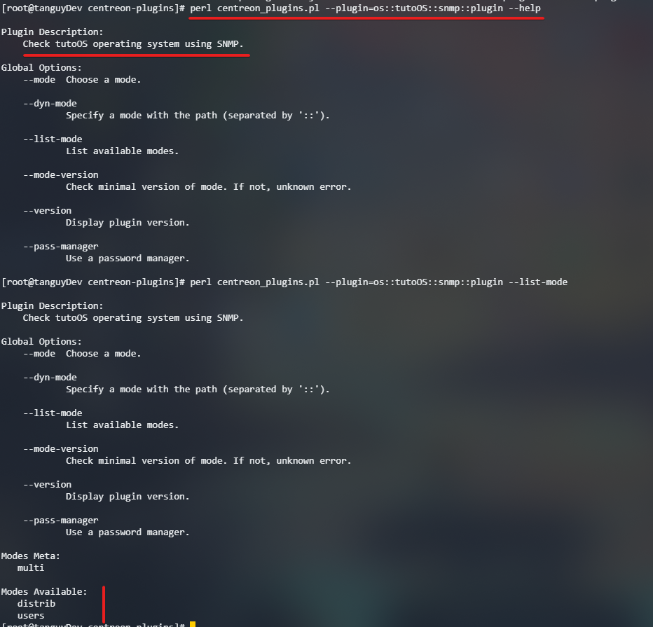

# tuto-centreon-plugins

## Table of contents
1. [INTRODUCTION](#introduction)
2. [STARTING OUR PROJECT](#starting-our-project)
3. [INITIATE OUR PLUGIN](#initiate-our-plugin)
4. [CREATE OUR FIRST MODE](#create-our-first-mode)

## INTRODUCTION <a name="introduction"></a>
This documentation is here to help you go through the development of a Centreon plugin.
We are going to monitore an imaginary operating system called tutoOS using SNMP.
There will be two modes that our plugin can use. One that checks if the system is a Linux and another one
to check the number of users connected to it.

## STARTING OUR PROJECT <a name="starting-our-project"></a>
- First of all let's create the tree file.

`cd /tmp/`

`git clone https://github.com/centreon/centreon-plugins.git`

`cd centreon-plugins`

`mkdir -p os/tutoOS/snmp/mode`

`touch os/tutoOS/snmp/plugin.pm`

`touch os/tutoOS/snmp/mode/users.pm`

`touch os/tutoOS/snmp/mode/distrib.pm`

## INITIATE OUR PLUGIN <a name="initiate-our-plugin"></a>

- open the plugin.pm file and write the following code

```perl
# path + name of the perl module
package os::tutoOS::snmp::plugin;

# load needed libraries
use strict;
use warnings;
use base qw(centreon::plugins::script_snmp);
use Data::Dumper;
```

- Now that we have loaded every usefull libraries we need to create a subroutine called "new"

```perl
# path + name of the perl module
package os::tutoOS::snmp::plugin;

# load needed libraries
use strict;
use warnings;
use base qw(centreon::plugins::script_snmp);

# this one is for debugging purpose, when your plugin is ready, you should remove it
use Data::Dumper;

sub new {
    # those are our subroutine private arguments.
    my ($class, %options) = @_;

    # create $self object
    my $self = $class->SUPER::new(package => __PACKAGE__, %options);

    # tell perl to search method called on the $self object within our package/class os::tutoOS::snmp::plugin
    bless $self, $class;

    # initiate our plugin version
    $self->{version} = '0.1';

    # initiate modes of our plugin
    %{$self->{modes}} = (
        'users'     => 'os::tutoOS::snmp::mode::users',
        'distrib'   => 'os::tutoOS::snmp::mode::distrib'
    );

    # return our object so we can use it later
    return $self;
}
```

- We are going to end the writing of the plugin.pm file by writing a small documentation

```
# path + name of the perl module
package os::tutoOS::snmp::plugin;

# load needed libraries
use strict;
use warnings;
use base qw(centreon::plugins::script_snmp);
use Data::Dumper;

sub new {
    # those are our subroutine private arguments.
    my ($class, %options) = @_;

    # create $self object
    my $self = $class->SUPER::new(package => __PACKAGE__, %options);

    # tell perl to search method called on the $self object within our package/class os::tutoOS::snmp::plugin
    bless $self, $class;

    # initiate version our plugin
    $self->{version} = '0.1';

    # initiate modes of our plugin
    %{$self->{modes}} = (
        'users'     => 'os::tutoOS::snmp::mode::users',
        'distrib'   => 'os::tutoOS::snmp::mode::distrib'
    );

    # return our object so we can use it later
    return $self;
}

# return true for require package
1;

__END__

# documentation using perl pod
=head1 PLUGIN DESCRIPTION

Check tutoOS operating system using SNMP.

=cut
```

At this point, you should already be able to use your plugin, you can check that by using the following command:
`perl centreon_plugins.pl --plugin=os::tutoOS::snmp::plugin --help`



## CREATE OUR FIRST MODE <a name="create-our-first-mode"></a>
We are going to start with an easy mode. We are just going to retrieve how many logged users we have on our
tutoOS server. Let people put alerting thresholds so we have a monitoring vibe to our plugin.

Here is the very beginning of our users.pm file
```perl
# path + name of the perl module
package os::tutoOS::snmp::mode::users;

# load needed libraries
use base qw(centreon::plugins::templates::counter);
use strict;
use warnings;
```

Now we are going to instanciate our mode

```perl
# path + name of the perl module
package os::tutoOS::snmp::mode::users;

# load needed libraries
use base qw(centreon::plugins::templates::counter);
use strict;
use warnings;

sub new {
    # those are our subroutine private arguments.
    my ($class, %options) = @_;

    # create $self object
    my $self = $class::SUPER::new(package => __PACKAGE__, %options);

    # tell perl to search method called on the $self object within our package/class os::tutoOS::snmp::plugin
    bless $self, $class;

    $options{options}->add_options(
        arguments => {
            'warning:s' => {
                name => 'warning'
            },
            'critical:s' => {
                name => 'critical'
            }
        }
    );
}

HOST-RESOURCES-MIB::hrSystemNumUsers.0
sysdescr
